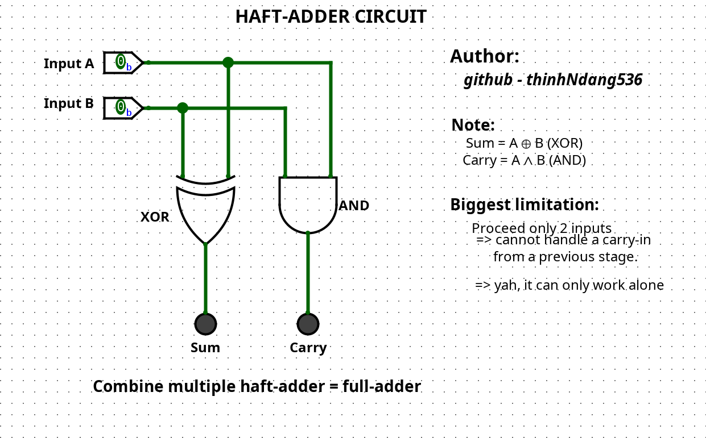

# Half-Adder Circuit Simulation

A clear visual representation and explanation of how the **Half-Adder** digital circuit works, including its logic and outputs. Designed for educational purposes and interactive simulation.

---

## 📌 Author

-   **Name**: thinhHNdang0536
-   **GitHub**: [github.com/thinhHNdang536](https://github.com/thinhHNdang536)

---

## 🧠 Circuit Logic

-   **Input A**: First input bit
-   **Input B**: Second input bit
-   **Sum**: The result of adding A and B (A XOR B)
-   **Carry**: The carry-out bit (A AND B)

---

## 🧪 Truth Table Scenarios

| A | B | Sum | Carry |
|---|---|-----|-------|
| 0 | 0 | 0   | 0     |
| 0 | 1 | 1   | 0     |
| 1 | 0 | 1   | 0     |
| 1 | 1 | 0   | 1     |

---

## 📷 Preview

> 

---

## 🤔 How does it actually works (short & easy)

-   A Half-Adder adds two single binary digits (bits).
-   It produces two outputs: a `Sum` and a `Carry` bit.
-   **Sum**: Uses an XOR gate (output is 1 if inputs are different).
-   **Carry**: Uses an AND gate (output is 1 only if both inputs are 1).
-   **Biggest Limitation**: It *cannot* handle a "carry-in" from a previous addition. This means it can only add two bits by itself, not as part of a larger chain of additions.
-   **Golden Fact**: Multiple Half-Adders can be combined to build a *Full-Adder*, which *can* handle carry-ins and perform *multi-bit binary addition*!

---

## 📌 Where is it mostly used?

-   As a *fundamental building block* for more complex arithmetic circuits like Full-Adders and multi-bit adders.
-   In basic digital calculations where only two single bits need to be added.

---

## 💡 Notes

-   Designed for digital logic learners.
-   Useful for understanding basic binary addition and combinational logic.
-   You can open this circuit with Logisim or any digital circuit simulator.

---

## 🚀 Future Ideas

-   Create a Full-Adder by combining two Half-Adders.
-   Add an animated GIF/video demonstrating the truth table in action.
-   Embed the `.circ` file (Logisim) directly.

---

## 📁 File

-   `.circ` = editable in Logisim

---

## 🗂 Resources

-   [Wikipedia: Half Adder](https://en.wikipedia.org/wiki/Adder_(electronics)#Half_adder)
-   [Logisim Download](https://github.com/logisim-evolution/logisim-evolution)
