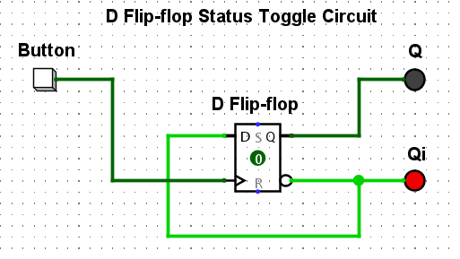

# D Flip-Flop Toggle Circuit

## 🔧 Description
- Toggle a D Flip-Flop on button click using its inverse output as input.
- Demonstrates memory state and signal inversion behavior.

## 🔁 Logic
- `Button` = one-time clock pulse.
- `Qi` (Q-inverse) feeds back into `D` to create toggling effect.

## 🖼 Preview

## 📁 File
- `.circ` = editable in Logisim
