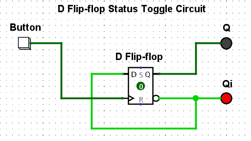

# D Flip-Flop Toggle Circuit

Toggle a D Flip-Flop on button click using its inverse output as input. Demonstrates memory state and signal inversion behavior, effectively creating a T (Toggle) flip-flop from a D-type.

---

## 📌 Author

-   **Name**: thinhHNdang0536
-   **GitHub**: [github.com/thinhHNdang536](https://github.com/thinhHNdang536)

---

## 🧠 Circuit Logic

-   **Button**: Acts as a momentary clock pulse (CP).
-   **D (Data Input)**: Connected directly to `Qi` (Q-inverse).
-   **Q**: The main output, representing the stored bit.
-   **Qi**: The inverse of Q. When fed back to D, it causes the toggle.
-   **S (Set override)**: (Implicitly not used in this basic toggle, but present in a D Flip-Flop)
-   **R (Reset override)**: (Implicitly not used in this basic toggle, but present in a D Flip-Flop)

---

## 🧪 Truth Table Scenarios (Toggle Behavior)

| Previous Q | Button (CP) | Next Q |
|:----------:|:-----------:|:------:|
| 0          | ↑ (rising edge) | 1      |
| 1          | ↑ (rising edge) | 0      |

👉 Each button click (rising edge of CP) flips the state of Q.

---

## 🖼 Preview

> 

---

## 🤔 How does it actually works (short & easy)

-   A standard D Flip-Flop simply stores its `D` input to `Q` on a clock pulse.
-   **In this circuit, we connect the inverse output (`Qi`) back to the `D` input.**
-   When the `Button` (clock pulse) is pressed:
    * If `Q` was 0, `Qi` is 1. This 1 is fed to `D`. So, `Q` becomes 1.
    * If `Q` was 1, `Qi` is 0. This 0 is fed to `D`. So, `Q` becomes 0.
-   This creates a **toggle effect**: every time the button is pressed, the output `Q` flips its state.
-   **Golden Fact**: This setup effectively transforms a D Flip-Flop into a T (Toggle) Flip-Flop!

---

## 📌 Where is it mostly used?

-   **To create a T (Toggle) Flip-Flop from a D Flip-Flop.**
-   **An alternation for the toggle state of a JK Flipflop.**
-   As a fundamental component in binary counters (e.g., ripple counters).
-   In frequency division circuits, where the output frequency is half of the input clock frequency.
-   Anywhere a simple "on/off" or "flip-flop" action is needed based on a single input pulse.

---

## 💡 Notes

-   Designed for digital logic learners.
-   Useful for understanding flip-flop behavior and simulating clock-driven memory elements.
-   You can open this project with Logisim or any digital circuit simulator.

---

## 🚀 Future Ideas

-   Add asynchronous `Set` (S) and `Reset` (R) inputs to control the initial state.
-   Implement a simple counter using multiple D Flip-Flop toggle circuits.
-   Create an animated GIF/video demonstrating the toggle behavior on button click.
-   Embed the `.circ` file (Logisim) directly.

---

## 📁 File

-   `.circ` = editable in Logisim

---

## 🗂 Resources

-   [Wikipedia: D Flip-Flop](https://en.wikipedia.org/wiki/Flip-flop_(electronics)#D_flip-flop)
-   [Logisim Download](https://github.com/logisim-evolution/logisim-evolution)
