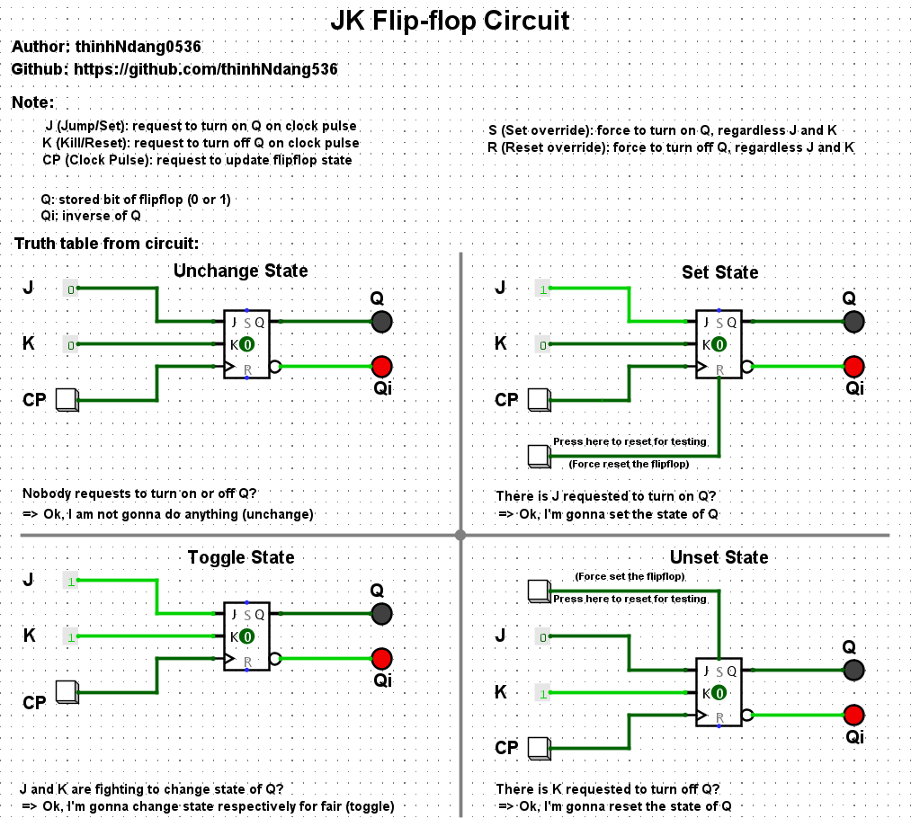

# JK Flip-Flop Circuit Simulation

A clear visual representation and explanation of how the **JK Flip-Flop** works, including all major states: **Unchange**, **Set**, **Reset**, and **Toggle**. Designed for educational purposes and interactive simulation.

---

## 📌 Author

- **Name**: thinhHNdang0536  
- **GitHub**: [github.com/thinhHNdang536](https://github.com/thinhHNdang536)

---

## 🧠 Flip-Flop Logic

- **J (Jump / Set)**: Request to set output `Q` to 1
- **K (Kill / Reset)**: Request to reset output `Q` to 0
- **CP (Clock Pulse)**: Trigger that updates the state
- **S (Set override)**: Force Q = 1 regardless of J/K
- **R (Reset override)**: Force Q = 0 regardless of J/K
- **Q**: Stored output bit
- **Qi**: Inverse of Q

---

## 🧪 Truth Table Scenarios

| J | K | CP | Result           |
|---|---|----|------------------|
| 0 | 0 |  ↑ | No change        |
| 1 | 0 |  ↑ | Set (Q = 1)      |
| 0 | 1 |  ↑ | Reset (Q = 0)    |
| 1 | 1 |  ↑ | Toggle Q/Qi      |

👉 All states visualized in 4 quadrants with simulation labels.

---

## 📷 Preview

> 

---

## 💡 Notes

- Designed for digital logic learners.
- Useful for understanding flip-flop behavior and simulating clock-driven memory elements.
- You can open this project with Logisim or any digital circuit simulator.

---

## 🚀 Future Ideas

- Add override behavior with `S` and `R`
- Embed `.circ` file (Logisim)
- Add GIF/video for dynamic toggle visualization

---

## 📁 File
- `.circ` = editable in Logisim

---

## 🗂 Resources

- [Wikipedia: JK Flip-Flop](https://en.wikipedia.org/wiki/Flip-flop_(electronics)#JK_flip-flop)
- [Logisim Download](https://github.com/logisim-evolution/logisim-evolution)

