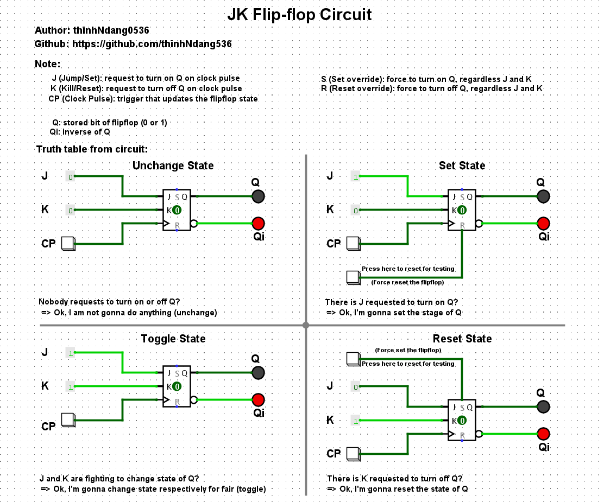

# JK Flip-Flop Circuit Simulation

A clear visual representation and explanation of how the **JK Flip-Flop** works, including all major states: **Unchange**, **Set**, **Reset**, and **Toggle**. Designed for educational purposes and interactive simulation.

---

## 📌 Author

- **Name**: thinhHNdang0536  
- **GitHub**: [github.com/thinhHNdang536](https://github.com/thinhHNdang536)

---

## 🧠 Flip-Flop Logic

- **J (Jump / Set)**: Request to set output `Q` to 1
- **K (Kill / Reset)**: Request to reset output `Q` to 0
- **CP (Clock Pulse)**: Trigger that updates the state
- **S (Set override)**: Force Q = 1 regardless of J/K
- **R (Reset override)**: Force Q = 0 regardless of J/K
- **Q**: Stored output bit
- **Qi**: Inverse of Q

---

## 🧪 Truth Table Scenarios

| J | K | CP | Result           |
|---|---|----|------------------|
| 0 | 0 |  ↑ | No change        |
| 1 | 0 |  ↑ | Set (Q = 1)      |
| 0 | 1 |  ↑ | Reset (Q = 0)    |
| 1 | 1 |  ↑ | Toggle Q/Qi      |

👉 All states visualized in 4 quadrants with simulation labels.

---

## 📷 Preview

> 

---

## 🤔 How does JK Flip-flop actually works (short & easy)

- JK Flip-Flop behaves like RS in most cases: no change, set, and reset ✅
- But unlike RS, when J = 1 and K = 1, it toggles the output instead of going into an error 🚫
- **Golden Fact**: JK = "RS but smarter — it knows how to toggle!" (RS really don't know what to do, bruh) 🧠✨
- **Cheating Tip**: Just learn the RS truth table, then remember that JK (toggles🔁) when both inputs are 1 🤓

---

## 📌 Where is JK Flip-flop mostly used?

- Bit counters such as digital watch circuit.
- **Why**: It can reliably store bit, which is perfect for making binary counting straightforward 👀😎

---

## 💡 Notes

- Designed for digital logic learners.
- Useful for understanding flip-flop behavior and simulating clock-driven memory elements.
- You can open this project with Logisim or any digital circuit simulator.

---

## 🚀 Future Ideas

- Add override behavior with `S` and `R`
- Embed `.circ` file (Logisim)
- Add GIF/video for dynamic toggle visualization

---

## 📁 File
- `.circ` = editable in Logisim

---

## 🗂 Resources

- [Wikipedia: JK Flip-Flop](https://en.wikipedia.org/wiki/Flip-flop_(electronics)#JK_flip-flop)
- [Logisim Download](https://github.com/logisim-evolution/logisim-evolution)

